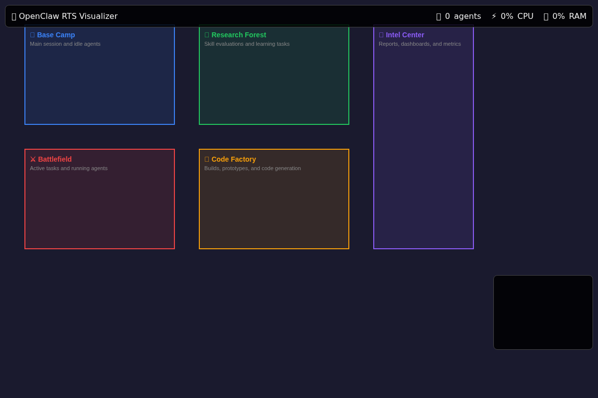

# OpenClaw RTS Visualizer

**Real-Time Strategy interface for OpenClaw agent orchestration**

Watch your OpenClaw agents come alive on a battlefield-style map. Track subagents, command them, and manage their lifecycle with the RTS muscle memory you already have.

## 🎮 Vision

Like [AgentCraft](https://getagentcraft.com/) but for OpenClaw:
- **Summon agents** as units on a strategic map
- **Command with missions** — research, code, validate, deploy
- **Watch real-time progress** — file operations, tool calls, results
- **Manage lifecycle** — spawn, pause, terminate, respawn

## 🗺️ Screenshot



*Current implementation showing the 5 zones: Base Camp, Research Forest, Battlefield, Code Factory, and Intel Center*

## 🗺️ Map Concept

```
┌─────────────────────────────────────────────────────────┐
│  🏠 BASE CAMP          🌲 RESEARCH FOREST              │
│  (Main Session)        (Skill Evaluations)             │
│                                                         │
│  👤 Archivist           🔬 Skill-1  🔬 Skill-2         │
│     [idle]                 [running]  [queued]         │
│                                                         │
│  ─────────────────────────────────────────────────────  │
│                                                         │
│  ⚔️ BATTLEFIELD        🏭 CODE FACTORY                 │
│  (Active Tasks)        (Prototypes)                    │
│                                                         │
│  🛡️ SubAgent-A         🔨 Build-1  🔨 Build-2         │
│     [researching]          [compiling] [testing]       │
│                                                         │
│  ─────────────────────────────────────────────────────  │
│                                                         │
│  📊 INTEL CENTER       💰 ECONOMY                      │
│  (Reports/Dashboard)   (Token Usage)                   │
│                                                         │
│  📈 4 skills today     💸 $12.45 this session          │
│  📉 2 blocked          ⏱️ 2h 34m runtime               │
└─────────────────────────────────────────────────────────┘
```

## 🎯 Features (MVP)

### Phase 1: Basic Visualization ✅
- [x] Real-time agent position tracking on map
- [x] Health/status bars (idle, running, blocked, done)
- [x] Click to inspect agent details
- [x] Zone-based organization (Base Camp, Research Forest, Battlefield, Code Factory, Intel Center)
- [ ] Log stream overlay

### Phase 2: Command & Control
- [x] Right-click context menu (spawn, pause, kill)
- [ ] Mission assignment (drag to assign task)
- [ ] Group selection (box select multiple agents)
- [ ] Hotkeys (RTS-style)

### Phase 3: Intelligence
- [ ] Auto-generated quest names for tasks
- [ ] Resource tracking (tokens, time, cost)
- [ ] Performance metrics per agent
- [ ] Alert system (blocked agents, errors)

## 🏗️ Architecture

```
┌─────────────────┐     WebSocket      ┌─────────────────┐
│   Browser UI    │ ◀────────────────▶ │   OpenClaw      │
│   (RTS Map)     │                    │   Gateway       │
└─────────────────┘                    └─────────────────┘
         │                                      │
         │                              ┌──────┴──────┐
         │                              │             │
    ┌────┴────┐                    ┌────┴────┐   ┌────┴────┐
│  React  │                    │  Main   │   │ SubAgent│
│  Canvas │                    │ Session │   │  Spawn  │
│  PixiJS │                    │         │   │         │
└─────────┘                    └─────────┘   └─────────┘
```

## 📁 Current Structure

```
openclaw-rts-visualizer/
├── src/
│   ├── server/
│   │   └── index.ts          # Express + WebSocket server
│   └── shared/
│       └── zones.ts          # Zone definitions & agent positioning
├── public/
│   └── index.html            # Canvas-based UI (vanilla JS)
├── dist/                     # Compiled output
├── docs/
│   └── screenshot-zones.png  # Current implementation screenshot
└── README.md
```

## 🚀 Quick Start

```bash
# Clone and setup
git clone https://github.com/hiveminderbot/openclaw-rts-visualizer.git
cd openclaw-rts-visualizer
npm install

# Start OpenClaw Gateway (in another terminal)
openclaw gateway start

# Start visualizer
npm run dev

# Open http://localhost:3000
```

## 📋 Project Structure

```
openclaw-rts-visualizer/
├── src/
│   ├── client/          # Browser UI (React + Canvas)
│   │   ├── components/
│   │   │   ├── Map.tsx           # Main RTS map
│   │   │   ├── AgentUnit.tsx     # Agent as game unit
│   │   │   ├── CommandPanel.tsx  # Orders/missions
│   │   │   └── IntelDashboard.tsx # Stats/reports
│   │   ├── engine/
│   │   │   ├── Renderer.ts       # Canvas rendering
│   │   │   ├── InputHandler.ts   # Mouse/keyboard
│   │   │   └── Camera.ts         # Map pan/zoom
│   │   └── state/
│   │       └── AgentStore.ts     # Agent state management
│   ├── server/          # WebSocket bridge
│   │   ├── gateway-bridge.ts     # Connect to OpenClaw
│   │   └── session-tracker.ts    # Track subagents
│   └── shared/          # Types, constants
├── docs/
│   ├── ARCHITECTURE.md
│   ├── API.md
│   └── CONTRIBUTING.md
└── tests/
```

## 🔌 OpenClaw Integration

The visualizer connects to OpenClaw Gateway via:
- **WebSocket** for real-time updates
- **sessions_list** to discover agents
- **sessions_history** for agent logs
- **sessions_send** to issue commands
- **subagents** API for lifecycle management

## 🎨 Design Principles

1. **RTS Muscle Memory** — Controls like StarCraft/Age of Empires
2. **Information Density** — Show everything at a glance
3. **Progressive Disclosure** — Click to drill down
4. **Joyful Interaction** — Make agent management fun

## 📜 License

MIT — Open source, contributions welcome!

---

**Built for OpenClaw** 🐾 | Inspired by [AgentCraft](https://getagentcraft.com/)
